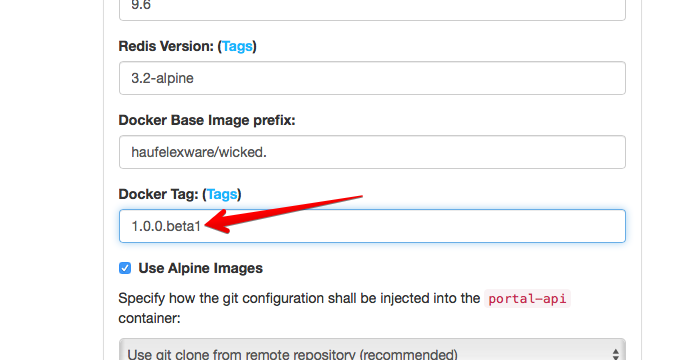

# wicked 1.0.0 beta

Hi! I am happy that you are interested in taking the latest wicked 1.0.0 beta for a test drive.

Please follow these easy(?) steps.

## Pre-comments

* Upgrading existing static configuration repositories may not (yet) work quite as you expect - please review at least the Authentication bits - they have changed substantially
* wicked 1.0.0 is probably not quite production ready, but we're not far away
* The documentation might still be a little off, but we're working on it
* Please feel free to open issues on [Github](https://github.com/Haufe-Lexware/wicked.haufe.io/issues)

## Prerequisites

You will need the following to try out wicked's 1.0.0 beta version:

* Either a docker host (a Windows or macOS local docker host will work) to deploy on
* Or a Kubernetes cluster (see below for more detailed requirements in that case)
* A local Docker host for configurating the API Management system

Start with picking the desired beta version from the actual docker tags: [Docker tags for haufelexware/wicked.portal](https://hub.docker.com/r/haufelexware/wicked.portal/tags/). Presumably pick the latest and newest beta.

Export that version as an environment variable, we will use it in the following scripts:

```
$ export WICKED_VERSION=1.0.0.beta1
```

### Creating a static configuration

Create a new directory and start the Kickstarter:

```
$ docker run -it --rm -p 3333:3333 -v $(pwd):/var/portal-api haufelexware/wicked.portal-kickstarter:${WICKED_VERSION}-alpine --new
```

Now a fresh configuration repository has been created. Ideally, create an actual git repository for this and commit it; prepare git credentials which are
able to pull this repository from the location your target is located. **NOTE**: If you just want to run wicked on a local computer, you do not need to do this.

Now you pick your desired target and continue there:

## Deploying to a Docker Host

### Variant 1: Deploying to your local machine without actual DNS entries

#### Step 1.1: Create compose file

In the Kickstarter, go to the [deployment page](http://localhost:3333/deployment). Perform the following steps:

Specify the desired wicked version in the "tag" input:



Specify "Build data-only container" for how the configuration shall be injected into the APIm:


Then click "Save". Kickstarter will create a `docker-compose.yml` and a `static/Dockerfile` file for you which contain all the services which wicked needs.

#### Step 1.2: Create self signed certificates

Go to the [SSL Tools page](http://localhost:3333/ssl) and click "Create Certificates".

#### Step 1.3: Create `/etc/hosts` entries for the local IP

Use `ifconfig` or a similar tool to retrieve your local machine IP. Note that using `127.0.0.1` or `localhost` will **not** work.

As a super user, open `/etc/hosts` and add entries for `portal.local` and `api.portal.local`:

```
##
# Host Database
#
# localhost is used to configure the loopback interface
# when the system is booting.  Do not change this entry.
##
127.0.0.1	localhost
255.255.255.255	broadcasthost
::1             localhost 

192.168.1.34    portal.local
192.168.1.34    api.portal.local
```

#### Step 1.4: Source settings and start the APIm

Now go into the `certs` repository (which was created by the SSL tools), and source the `default.sh` file:

```
$ cd certs
$ . ./default.sh
$ cd ..
```

Now you're ready to start the APIm solution:

```
$ docker-compose up -d
```

Verify that the containers run (this may take a while, depending on how fast the images can be pulled from the Docker Hub):

```
$ docker ps
```

As soon as all containers are up and running, you will now be able to access wicked at [https://portal.local](https://portal.local). You browser
will scream at you because of the self signed certificates, but that's normal; accept the changes and try it out. Note that both `portal.local` and
`api.portal.local` is used in the browser, so that you will need to accept both these certificates.

### Variant 2: Deploying to a Docker host with real certificates and real DNS entries

Follow the instructions on [deploying to a docker host](deploying-to-docker-host.md).

## Deploying to Kubernetes

When deploying to Kubernetes, it's assumed that you already have an existing Kubernetes cluster. It is also mandatory that
you have checked in the API configuration into a repository which is accessible from within the Kubernetes cluster.

You will need two DNS entries pointing to the ingress controller of your Kubernetes cluster, plus certificates.

Now follow the [instructions to install using Helm](../wicked/README.md).

To start over if something bad happened, you can use the following command:

```
$ helm delete <release name> --purge
```

### On Chart versions

The chart version of the wicked Helm chart will **not** change until 1.0.0 has been released and version 1.0.1 is in the pipeline. This means that you
will not be able to use the usual upgrading mechanisms without possibly causing trouble in your cluster.

The Helm chart will also (probably) evolve until the beta phase of wicked is over.
