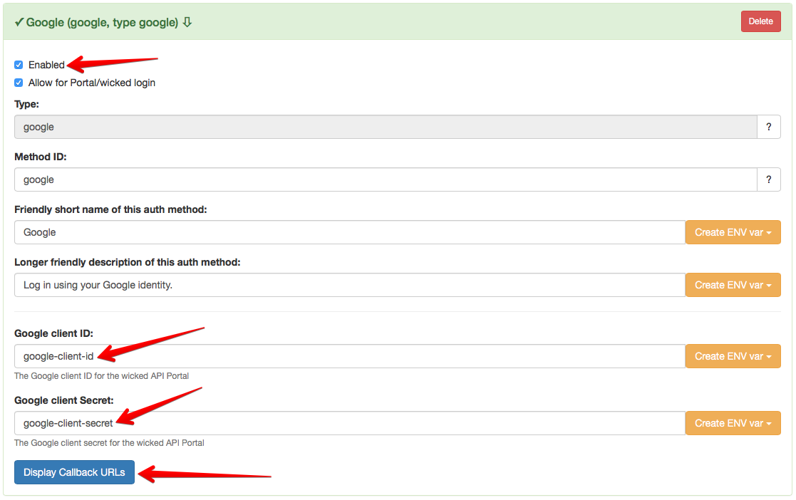

# Configuring Google Login

## Introduction

The API Portal can use Google for federating user logins to the API Portal. Users which are logged in using Google Social Login will automatically be registered for full use of the API Portal:

* The primary email address which is used with Google is taken as a verified email address in the API Portal automatically (the user is auto-verified)
* The API Portal will explicitly ask for permission to access to the email address
* Name and email address are automatically retrieved from Google
* The ID from Google is used as a unique id (prepended with `GitHub:`) in the API Portal

This is probably a good fit for public facing developer API Portals, as most people tend to (also) have a Google Account.

## Step 0: Prerequisites

You need the following things:

* A running [kickstarter](creating-a-portal-configuration.md), pointing to your configuration repository
* The fully qualified domain name (FQDN) of your API Portal(s)
* A valid Google Developer account with access to the [Google Developer Console](https://console.developers.google.com)

## Step 1: Create a Google Project and activate the needed Google APIs

In the Google Developer Console at [console.developers.google.com](https://console.developers.google.com) you will need to create a new Project (or re-use an existing one). Follow the on-screen instructions to do that. The Project should reflect that you are doing something for the API Portal, so suitable names should involve the name of your API Portal.

This is much similar to the concept of "Applications" in the API Portal itself, but more elaborate.

For this Project, you will need to activate two Google APIs:

* Google Identity and Access Management (IAM) API
* Google+ API

This can be done using the "ACTIVATE API" button on top of the Dashboard page.

## Step 2: Register your API Portal(s)

To register an application (your API Portal in this case) to be able to log in using Google, perform the following steps:

* On the left side of the developer console, click the "Credentials" tab/pane
* Click the blue button "Create credentials" and select "OAuth Client Id"

* Select "Web application" as the client type and specify a Client name, e.g. `MyCompany API Portal - Dev` or similar
* Specify the callback URL as the FQDN of your API portal; to get the callback URL, see bottom of this page

It's suboptimal that there is a slight circular dependency here, but Google as IDP and wicked as application need to know *of each other*, so you will need to start in parallel on Step 2 at this point.

* Click the "Create" button, and you will be presented the Client ID and Client Secret you will need for Step 3:

**Notes**:

* You will need separate applications for separate instances, e.g. for Dev, Test and Prod; each have a different set of credentials
* By registering a `localhost` callback URL, you can register a separate local testing application; this works just fine if you are in a developer setup
    * You could also register a DNS name you have specified in your `/etc/hosts` (or on Windows, `HOSTS` file) with Google. As OAuth 2.0 is a purely client side redirect flow, this will also work just fine, as long as your local browser is able to resolve the DNS name.
    * Combine this with a [`localhost` or `development` environment](deployment-environments.md) for most flexibility.

## Step 3: Configure the API Portal

Next, you need to configure the API Portal to know the Google credentials. To do that,open up the kickstarter on the [Default Authorization Server](http://localhost:3333/authservers/default), and open up the predefined "google" Auth Method box:

Fill in the required fields.

To learn more about deployment enviroments, see the [documentation on that](deployment-environments.md). 

Now all you have to do is to check in your changes to source control and redeploy your API Portal(s). Google social login should now be working.

### Getting the Callback URLs

Use the "Display Callback URLs" button to display the Callback URLs which you need to register your API Gateway with Google (see image above).
