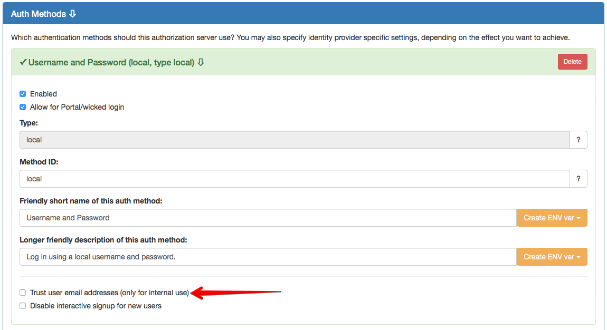

# Local Authentication

Wicked can act as an identity provider in itself, supporting all OAuth 2.0 flows using its local username and password database.

This enables fast and easy implementation of OAuth 2.0 flows in your own applications. In some cases, you may also have the use case of really acting as an identity provider to other parties, where your wicked installation is the source of truth for users also for third party applications.

The `local` auth type is the standard auth method for fresh wicked installations, and it allows to identify users via email address and password.

## Setting up local authentication

Using the [Kickstarter](creating-a-portal-configuration.md), the local auth method can be configured, at the [Authorization Server](http://localhost:3333/authservers/default) page:

The configuration options are:

* **Enabled**: Check to enable this auth method
* **Allow for portal/wicked UI**: Check to allow logging in to the wicked portal using this auth method
* **Type**: Set to local
* **Method ID**: Defaults to `local`, but can be changed to any valid ID
* Descriptions
* **Trust user email addresses**: For local or internal installations it may be useful to use this option to avoid users having to verify their email addresses; for public portals, you will want to tick this option (and also deploy a portal mailer to send out these mails).
* **Disable interactive signup**: In case you tick this check box, it will not be possible for users to interactively sign up with a new user
