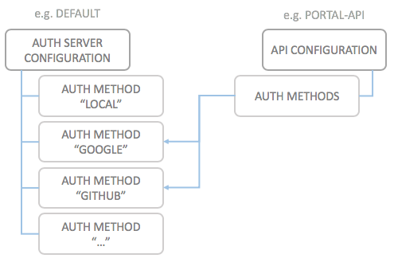

# Auth Methods

The default [Authorization Server](authorization-servers.md) supports various ways of establishing the user identity for use with OAuth2.0 flows. Each of these ways are called **Auth Methods**.

An Auth Method can be "use wicked's local user database", or "use a Google identity". Any Auth Method which has been successfully configured with the default authorization server can be used to

* Secure access to any API
* Secure access to the wicked API, and by corollary to the wicked Portal UI

## Configuration Architecture

The following image shows where auth methods are configured and how they are linked to the API configuration:

An Authorization Server has a set of defined Auth Methods (with IDs). In the API configuration, any (OAuth2 secured) API can be linked to one or more auth methods from the authorization server configuration.

In the image, the example API is the wicked portal API, which is also linked to a set of auth methods of the default authorization server.

The wicked Kickstarter assists you in editing and creating auth methods, and also in linking APIs to using these auth methods.

## Available Auth Method types

Currently, wicked supports the following Auth Method types, which can be used both for the API Portal itself, as well as for securing APIs:

* [`local`: Local username and password authentication](auth-local.md)
* [`google`: Google+ login](auth-google.md)
* [`github`: Github login](auth-github.md)
* [`twitter`: Twitter login](auth-twitter.md)
* `oauth2`: Generic JWT based OAuth2 (authorization code) login (TODO: docs)
* [`adfs`: Microsoft ADFS login](auth-adfs.md)
* [`saml`: SAML based login](auth-saml.md)

In the future, there will be additional auth methods, such as 

* OpenID Connect (may be added to `oauth2` as a special case of getting profile data)
