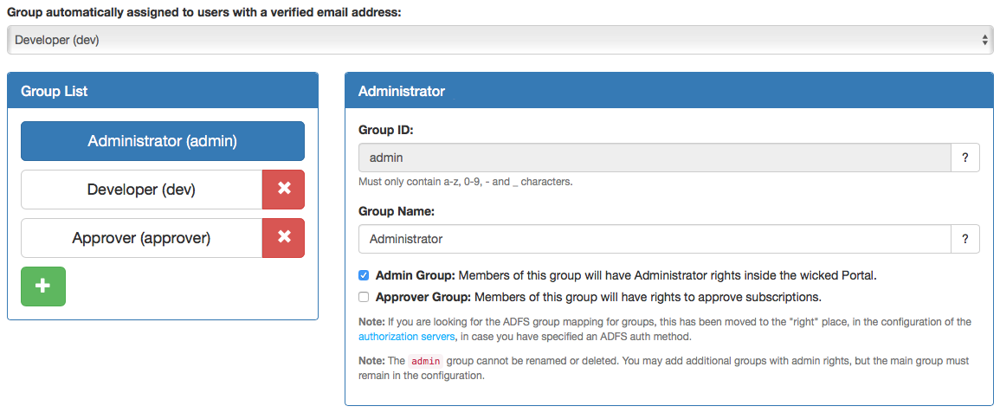

# Defining User Groups

## Introduction

User groups can be used to restrict access to APIs, API Plans and Content. Depending on how restrictions are to be used in the API Portal, you will need one or more additional user groups.

User groups are intended to be used to restrict access to certain domains, such as "User Management APIs", or "Product APIs". This is not mandatory though, and user groups can possibly be used for other things as well.

APIs, API Plans and Content can always only be assigned to a single user group (or none). The n:1 relationship is only present on the User object, which can be part of multiple groups, and thus get access to multiple domains.

**See also**:

* [Defining an API](defining-an-api.md)
* [Setting up Plans](setting-up-plans.md)
* [Adding Custom Content](adding-custom-content.md)

## Assigning User Groups

User Groups can be assigned via one of the following mechanisms:

* Automatically when a user validates his email address (or is logged in using federation), see below
* Via [ADFS Group federation](auth-adfs.md)
* Manually by an API Portal Admin (who is a member of an admin group)

## Prerequisites

* You have [created a portal configuration](creating-a-portal-configuration.md) repository
* The kickstarter is running, pointing to your configuration repository

You can now review the user groups using the [Groups Configuration](http://localhost:3333/groups).

## Predefined User Groups

For fresh configurations, there are two predefined user groups, of which the API Portal only assumes that the `admin` group will always be available (and which you cannot delete via the Kickstarter).

### User group `dev`

The user group `dev` is a group which is by default used as the default group for portal users which have a validated email address. This is usually a good idea to have such a group to rule out developers for which you aren't sure you can reach them via email.

Regarding other things, the API Portal does not rely in any way on this specific user group being present. You can remove it, rename it or leave it as it is.  

The default user group for users with validated email addresses can be [specified using the kickstarter](http://localhost:3333/groups).

### User group `admin`

All configurations should contain an `admin` user group. This is the default Admin group. Nothing prevents you from having additional groups with the "Administrator Group" set; please note though that there is no such thing as "more admin than others". Either you are a member of a group with the Admin flag set, or you are not. WHICH group this is does not matter.

As described in the [setup documentation](creating-a-portal-configuration.md), by default there is exactly one Administrator predefined, the Admin user with the user id `1` (email `admin@foo.com`, password `wicked`); leverage this user to grant admin rights to your own user (if you are the admin) and subsequently remove the password from the default admin user to prevent people logging in with that super user.

**See also**:

* [Approver role for User Groups](defining-user-groups-approver-role.md)

## User group use cases

The followings sections describe typical use cases for user groups.

### Restricting access to APIs for users without valid email address

Some use cases may require that not all APIs are visible to the public. By defining the default user group for validated users to the `requiredGroup` property of an API, you will get the following effect:

* The public will not be able to see the API
* Logged in users which have not yet validated their email address will not see the API
* As soon as the user has validated the email address, he will see the API

### Restricting access to API Plans

In some cases it may be helpful to restrict the access to certain [API Plans](setting-up-plans.md) to a user group.

**Example**: By default (e.g. the `dev` group), the only plan available have a strict rate limiting in place to be sure nobody will overload the API backend. Some other users, e.g. the ones conducting load testing, may be assigned to a new user group `load_test` (or similar), for which there exists another API Plan (e.g. `unlimited`) which does not have the same restrictions.

**Example**: Perhaps you have a set of developers whom you trust more than others, and you do not need to approve of them getting API access. You could then create a new user group `trusted_dev` and create additional plans for this user group, which do not require approval from an Admin.

### Automatic federation of ADFS groups to API Portal groups

The ADFS Authentication enables federating ADFS groups to API Portal groups ([see documentation](auth-adfs.md)).

This enables a centralized configuration of user groups even before they have logged in to the API Portal the first time. When defining user groups, you can specify (comma separated) the ADFS group this group corresponds to.

Even if you have multiple API Portals, you can make certain users (belonging to a specific ADFS group) member of specific user groups without further manual intervention.

**Note**: This also works with the `admin` group, so that you can automatically assign users Admin rights when they log in the first time.

### Restricting access to custom content

Just like for APIs and Plans, you can use the `requiredGroup` property of a content companion JSON file to restrict the access to the page to users which are members of a certain group.

This can be useful to restrict content for certain domains to certain groups of users.

**See also**:

* [Adding Custom content](adding-custom-content.md)

